# Neuton.AI Gesture Based Remote Control Device on 8-bit AVR128DB48

- [Overview](#overview)
- [Hardware Used](#hw-used)
- [Hardware Setup](#hw-setup)
- [Setup Software Environment](#setup-sw-env)

## Overview <div id='overview'/>

This project demonstrates a gesture based remote control device using [__AVR128DB48 Curiosity Nano Kit__](https://www.microchip.com/en-us/development-tool/ev35l43a) and [__TDK ICM-42688-P__](https://www.mikroe.com/6dof-imu-14-click) IMU Sensor. The AVR Curiosity Nano development kit could be connected to the PC via Serial Port and using gestures the user can control media stream or slides of the presentation. Based on accelerometer and gyroscope data the Neuton.AI model could recognize __7 classes__ of gestures: Swipe Right, Swipe Left, Double Tap(Shake), Rotation Clockwise and Counter clockwise, No Gestures(IDLE) and Unknown Gesture.

## Hardware Used <div id='hw-used'/>

[__AVR128DB48 Curiosity Nano Kit__](https://www.microchip.com/en-us/development-tool/ev35l43a)

The AVR128DB48 Curiosity Nano Evaluation Kit is a hardware platform to evaluate microcontrollers in the AVR® DB Family. Supported by both MPLAB® X IDE and Atmel Studio 7, the board provides easy access to the features of the AVR128DB48.
The Curiosity Nano series of evaluation boards include an on-board debugger, no external tools are necessary to program and debug the AVR128DB48.

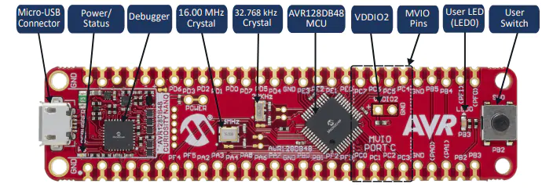

[__Curiosity Nano Base For Click Boards™__](https://www.microchip.com/en-us/development-tool/AC164162)

The Microchip Curiosity Nano Base for Click boards™ evaluation kit is a hardware extension platform to ease the connection between Curiosity Nano kits and extension boards like the mikroBUS Click modules and Xplained Pro extension boards.

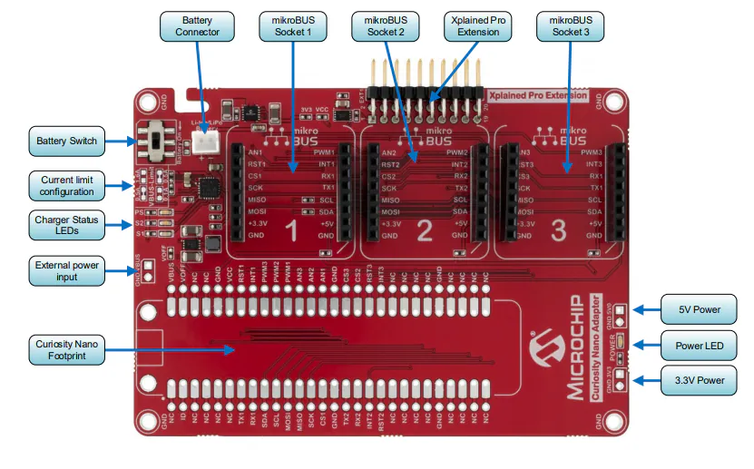

[__6DOF IMU 14 Click__](https://www.mikroe.com/6dof-imu-14-click)

6DOF IMU 14 Click is a compact add-on board that contains a 6-axis MEMS motion tracking device combining a 3-axis gyroscope and a 3-axis accelerometer. This board features the ICM-42688-P, high precision 6-axis MEMS motion tracking device, from TDK InvenSense.

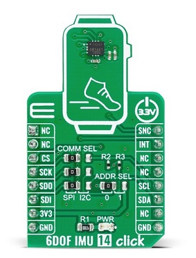

## Hardware Setup <div id='hw-setup'/>

Connecting a Curiosity Nano microcontroller kit to Curiosity Nano Base for Click boards can be done in
several ways. The most practical way is to solder sockets to the base board, and headers to the Curiosity
Nano microcontroller kit. It is also possible to skip the header and socket, and solder the Curiosity Nano
microcontroller kit directly to the base board. 

Connect 6DOF IMU 14 Click add-on board into __mikroBUS Socket 1__. The complete setup of the dev kit should be exactly the same as the following figure:

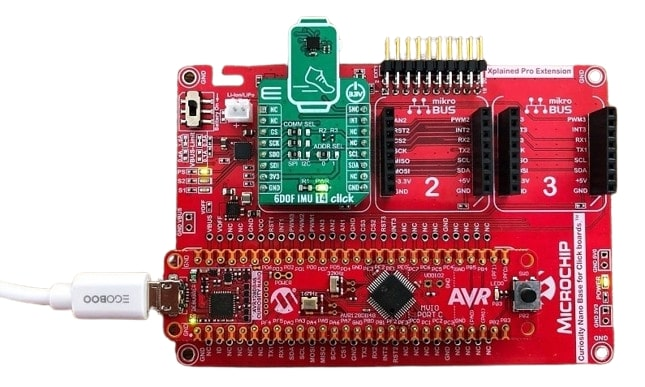

## Setup Software Environment <div id='setup-sw-env'/>

To set this project up, you will need to install the following software:
- MPLAB® X IDE (https://microchip.com/mplab/mplab-x-ide)
- MPLAB® XC8 compiler (https://microchip.com/mplab/compilers)
- [**Optional**] TeraTerm Terminal (https://teratermproject.github.io/index-en.html)

## Setup Firmware Project <div id='setup-fw-proj'/>

1. Clone this repository: https://github.com/Neuton-tinyML/neuton-avr128db48-remotecontrol
2. In the MPLAB® X IDE, right-click on `Projects` view and choose `Open Project...`

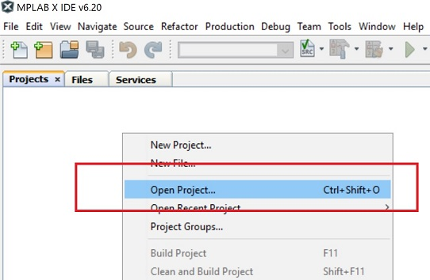

3. Browse to the repository directory `./neuton-avr128db48-remotecontrol` and select `neuton-avr128db48-remote-ctrl.X` project, and click `Open Project`

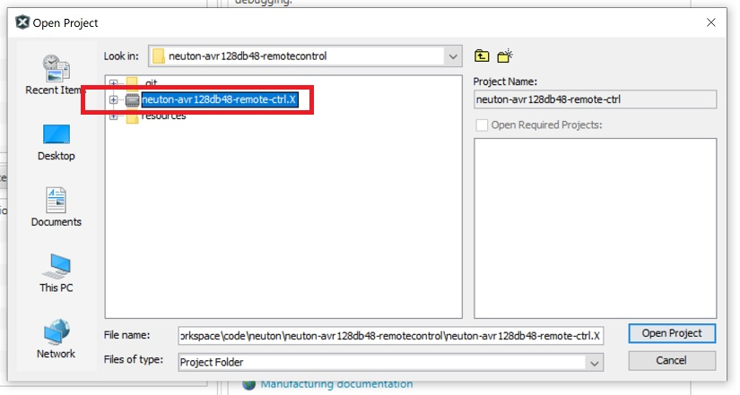

4. Now you should be able to see this project in `Projects` view tab

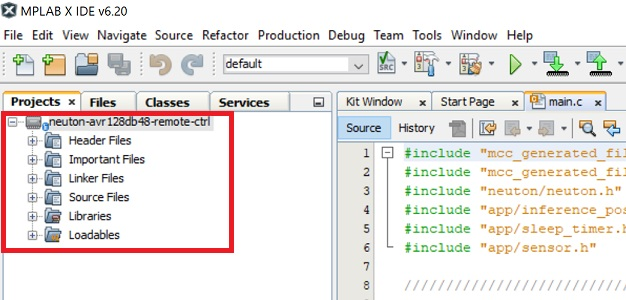

5. To build firmware click `Build Project` button in the toolbar, and you should see a message about the successful build in `Output` terminal:

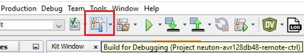
 
 6. To Program device, plug the Curiosity Nano into your PC via USB and click `Make and Program Device` button in the toolbar:

 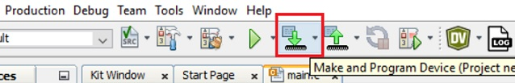

 7. Explore the project and Neuton.AI model capabilities!

## Model specifications <div id='model-spec'/>

The Neuton.AI Gesture Recognition solution memory footprint:

__Version 1.0.2__
|                       |    FLASH       |   SRAM      |
| --------------------- | -------------- | ----------- |
| __Total Footprint__   | __7.4 kB__     | __1.4 kB__  |
| Signal Processing     | 4.0 kB         | 1.3 kB      |
| Inference Engine      | 2.8 kB         |  0.07 kB    |
| Model                 | 0.6 kB         | 0 kB        |

Model Perfomance:
+ 7 classes.
+ 36 neurons.
+ Holdout Balanced Accuracy: __98.2 %__.
+ Inference time ( __including__ Signal processing ): __~8 ms__.

*Estimated on AVR128DB48, 24 MHz, compiled with -O2 Microchip XC8 toolchain*

## How The Project Works <div id='how-works'/>

 The project has UART logs and you can open the Serial Port to see them. The Serial Port(USART) has the following configuration:

```
Baudrate:       115200
Data:           8-bit
Parity:         none
Stop bits:      1-bit
Flow control:   none
```

Once the device is up and running, in the serial port terminal you should see similar messages:

```
===== Neuton.AI AVR128DB48 Gestures Recognition Demo =====
Neuton Version: 4.0.1
Looking for user gestures...
```
__How to Make Gestures__
> **_NOTE:_**  The dataset for creating this model is very immature and this affects the generalization of the model on different persons, so please follow the instructions for good gesture recognition.

To begin with, please make sure that the default (initial) position of the device is the same as following:

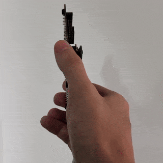

Next, follow the images on how to make gestures. For better recognition use your wrists more when making gestures, and not your whole hand:

__Swipe Right & Left__
|                                        |                                               |
| -------------------------------------- | --------------------------------------------- |
| 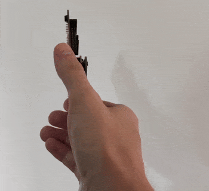 | 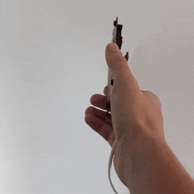        |
| Swipe Right                            |    Swipe Left                                |

__Rotation Clockwise & Counter Clockwise__

|                                           |                                               |
| --------------------------------------    | --------------------------------------------- |
| 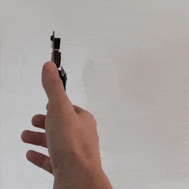 | 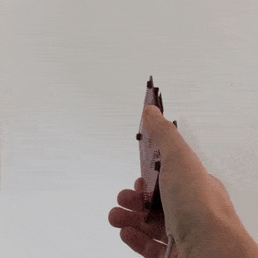      |
| Rotation Clockwise(Right)                 |    Rotation Counter Clockwise(Left)            |

__Double Tap__

|                                        |
| -------------------------------------- |
| 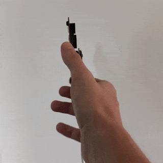 |
| Double Tap                             |

When performing gestures with the device, in the terminal, you should see the following messages:

```
Looking for user gestures...
Predicted SWIPE LEFT 89 %
Predicted DOUBLE TAP 96 %
Predicted SWIPE LEFT 100 %
Predicted SWIPE RIGHT 98 %
Predicted SWIPE LEFT 100 %
Predicted DOUBLE TAP 87 %
Predicted ROTATION RIGHT 82 %
Predicted ROTATION RIGHT 98 %
Predicted ROTATION RIGHT 96 %
Predicted ROTATION LEFT 74 %
Predicted ROTATION LEFT 99 %
Predicted ROTATION LEFT 99 %
Predicted ROTATION LEFT 99 %
```
Have fun and use this model for your future gesture control projects!